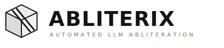

<p align="center">
  <picture>
    <source media="(prefers-color-scheme: dark)" srcset="assets/logo.svg">
    <source media="(prefers-color-scheme: light)" srcset="assets/logo.svg">
    
  </picture>
</p>

<p align="center">
  <strong>0–1.5% refusal rate &nbsp;·&nbsp; 0.01 KL divergence &nbsp;·&nbsp; 135+ model configs &nbsp;·&nbsp; Zero manual tuning</strong>
</p>

<p align="center">
  <a href="https://pypi.org/project/abliterix/"></a>
  <a href="https://www.python.org/downloads/"></a>
  <a href="https://www.gnu.org/licenses/agpl-3.0"></a>
  <a href="https://huggingface.co/wangzhang"></a>
</p>

---

## Table of Contents

- [Quick Start](#quick-start)
- [Architecture](#architecture)
- [How It Works](#how-it-works)
- [Results](#results)
- [Features](#features)
- [Model Support](#model-support)
- [Web UI](#web-ui)
- [MoE Support](#moe-support)
- [Configuration](#configuration)
- [Hardware & VRAM](#hardware--vram)
- [Research Tools](#research-tools)
- [References](#references)
- [Citation](#citation)
- [Acknowledgments](#acknowledgments)
- [Datasets](#datasets)
- [Contributing](#contributing)
- [License](#license)

---

Abliterix finds the optimal abliteration parameters for any transformer model using [Optuna](https://optuna.org/) TPE optimization. It co-minimizes refusals and KL divergence from the original model — producing decensored models that retain as much intelligence as possible.

Works with dense models, multimodal models, MoE architectures, SSM/hybrid models, and vision-language models — with **135+ pre-built configs** covering Llama, Gemma, Phi, DeepSeek, Qwen, Mistral, Yi, InternLM, Falcon, Cohere, and more.


## Architecture

Abliterix integrates techniques from **9 peer-reviewed papers** (NeurIPS, ACL, ICLR) into a unified, automated steering pipeline. The table below shows what each technique solves and where it fits:

| Dimension | Problem | Technique | Paper | Config |
|-----------|---------|-----------|-------|--------|
| **What to remove** | Raw refusal vector is polysemantic — entangles refusal with syntax and capability circuits | **Surgical Refusal Ablation (SRA)** | [Cristofano (2026)](https://arxiv.org/abs/2601.08489) | `vector_method = "sra"` |
| **What to remove** | Single direction misses refusal subspace | **Multi-direction abliteration** | [Glaze et al. (2026)](https://arxiv.org/abs/2602.02132) | `n_directions = 3` |
| **What to remove** | Manual layer/direction selection | **COSMIC** auto-selection | [Siu et al., ACL 2025](https://arxiv.org/abs/2506.00085) | `vector_method = "cosmic"` |
| **What to remove** | Mean difference misses distribution shape | **Optimal Transport** matching | [2026](https://arxiv.org/abs/2603.04355) | `vector_method = "optimal_transport"` |
| **Where to steer** | Steering all layers wastes KL budget | **Discriminative Layer Selection** | [Selective Steering (2026)](https://arxiv.org/abs/2601.19375) | `discriminative_layer_selection = true` |
| **Where to steer** | Static direction ignores context | **Steering Vector Fields (SVF)** | [2026](https://arxiv.org/abs/2602.01654) | `steering_mode = "vector_field"` |
| **How to steer** | Addition-based steering disrupts norms | **Angular Steering** | [Vu & Nguyen, NeurIPS 2025 Spotlight](https://arxiv.org/abs/2510.26243) | `steering_mode = "angular"` |
| **How to steer** | 2D planar rotation ignores hypersphere geometry | **Spherical Steering** (geodesic) | [2026](https://arxiv.org/abs/2602.08169) | `steering_mode = "spherical"` |
| **How to preserve** | Standard projection destroys helpfulness signal | **Projected Abliteration** | [grimjim (2025)](https://huggingface.co/blog/grimjim/projected-abliteration) | `projected_abliteration = true` |

### Why This Matters

Most abliteration tools implement one or two of these techniques. Abliterix is the only framework that integrates all of them into a single automated pipeline:

- **SRA** cleans the refusal vector so you don't damage math, code, or reasoning capabilities (47x KL improvement on VLMs [[1]](https://arxiv.org/abs/2601.08489))
- **SVF** makes the steering direction adapt per-token, so the same model handles "make a bomb" and "make a cake" differently
- **Spherical Steering** respects the geometric structure imposed by RMSNorm in modern LLMs
- **Discriminative Layer Selection** skips layers where steering would only add noise (15.7x KL reduction [[2]](https://arxiv.org/abs/2601.19375))
- **Optuna TPE** automatically finds the optimal combination across all these dimensions — no manual tuning required

The recommended configuration for maximum quality:

```toml
[steering]
vector_method = "sra"
steering_mode = "spherical"
discriminative_layer_selection = true
projected_abliteration = true
```


## Quick Start

```bash
pip install -U abliterix
prometheus --model Qwen/Qwen3-4B-Instruct-2507
```

That's it. The process is fully automatic — after optimization completes, you can save the model, upload to Hugging Face, or chat with it interactively.

> **Windows**: use `python scripts/run_prometheus.py --model <model>` or set `PYTHONIOENCODING=utf-8` to avoid Rich encoding issues.


## How It Works

Language models learn to refuse harmful queries through specific activation patterns in their residual stream. Abliterix identifies these patterns and surgically removes them:

1. **Compute refusal directions** — pass harmless and harmful prompts through the model, extract per-layer residual activations, and compute the difference vector that characterizes "refusal behavior"
2. **Orthogonalize** — project out the component aligned with normal "good" responses, isolating only the refusal signal
3. **Abliterate via LoRA** — apply rank-1 weight modifications to attention and MLP components, weighted by a kernel function across layers. Changes are captured as lightweight LoRA adapters, not destructively applied to base weights
4. **Optimize** — Optuna's Tree-structured Parzen Estimator searches over kernel shape, fractional direction index, and per-component abliteration strength, selecting Pareto-optimal configurations that minimize both refusals and model degradation


## Results

Abliterated models uploaded to [Hugging Face](https://huggingface.co/wangzhang):

| Model | Refusals | KL Divergence | Trials |
|-------|----------|---------------|--------|
| [LFM2-24B-A2B](https://huggingface.co/wangzhang/LFM2-24B-A2B-abliterated) | **0/100 (0%)** | 0.0079 | 50 |
| [GLM-4.7-Flash](https://huggingface.co/wangzhang/GLM-4.7-Flash-abliterated) | 1/100 (1%) | 0.0133 | 50 |
| [Devstral-Small-2-24B](https://huggingface.co/wangzhang/Devstral-Small-2-24B-Instruct-abliterated) | 3/100 (3%) | 0.0086 | 50 |
| [Qwen3.5-122B-A10B](https://huggingface.co/wangzhang/Qwen3.5-122B-A10B-abliterated) | 1/200 (0.5%) | 0.0115 | 25 |
| [Qwen3.5-35B-A3B](https://huggingface.co/wangzhang/Qwen3.5-35B-A3B-abliterated) | 3/200 (1.5%) | **0.0035** | 50 |
| [Qwen3.5-27B](https://huggingface.co/wangzhang/Qwen3.5-27B-abliterated) | 3/200 (1.5%) | 0.0051 | 35 |
| [Qwen3.5-9B](https://huggingface.co/wangzhang/Qwen3.5-9B-abliterated) | 2/200 (1%) | 0.0105 | 50 |
| [Qwen3.5-4B](https://huggingface.co/wangzhang/Qwen3.5-4B-abliterated) | 3/200 (1.5%) | 0.0065 | 50 |
| [Qwen3.5-0.8B](https://huggingface.co/wangzhang/Qwen3.5-0.8B-abliterated) | **0/200 (0%)** | 0.0087 | 100 |

### Key Findings

> **Orthogonalized directions reduced refusals by 67%** compared to raw abliteration in controlled experiments — the single most impactful optimization.

- **Consistent sub-2% refusals across all model sizes** — from 0.8B to 122B, every model achieves 0–1.5% refusal rate. The 0.8B model reaches a perfect 0/200.
- **More trials unlock better parameters** — the 27B improved from 7 to 3 refusals when trials increased from 15 to 35. The 4B dropped from 34 refusals (17%) to just 3 (1.5%) with continued optimization.
- **Per-layer direction index is critical at scale** — for 122B, independently optimizing the refusal direction per layer reduced refusals from 180/200 to 1/200. A single global direction failed entirely.
- **MoE hybrid steering** — combining LoRA abliteration with router weight suppression and fused expert abliteration proved essential for MoE architectures.
- **Non-transformer architectures work too** — LFM2's hybrid conv+attention architecture achieved 0% refusals by steering convolution output projections alongside attention and MLP components.

### Architecture A/B Test (Qwen3.5-0.8B)

Controlled comparison of new techniques vs baseline, grid-searching λ ∈ {0.5, 0.8, 1.0, 1.2, 1.5, 2.0} per method and selecting the best Pareto point (lowest refusals → lowest KL). Reproduced across two independent runs.

| Method | Best λ | Refusals | KL | KL vs Baseline |
|--------|--------|----------|-----|----------------|
| A: Baseline (mean+ortho) | 2.0 | 0/100 | 14.000 | — |
| B: Projected (mean+proj+win) | 2.0 | 0/100 | 13.938 | -0.4% |
| **C: Disc. layers** (mean+ortho+disc) | 2.0 | 0/100 | **12.375** | **-11.6%** |
| D: SRA (sra+proj+disc) | 2.0 | 0/100 | 12.813 | -8.5% |
| **E: Spherical** (mean+ortho+sph+disc) | 2.0 | 0/100 | **12.375** | **-11.6%** |
| **F: SVF** (mean+ortho+svf+disc) | 2.0 | 0/100 | **12.375** | **-11.6%** |
| G: Full new arch (SRA+sph+disc+proj) | 2.0 | 0/100 | 12.813 | -8.5% |

**Pareto front**: C, E, F (tied at lowest KL = 12.375)

Key findings from the A/B test:

> **SRA eliminates refusals at 1.9x lower steering strength.** Methods D and G achieve 0 refusals at λ=0.8, while the baseline requires λ=1.5. A cleaner refusal vector needs less force to ablate — which means less collateral damage to model intelligence.

- **Discriminative layer selection is the single biggest KL reducer** — all methods with disc. selection (C/D/E/F/G) beat baseline by 8–12%, confirming the [Selective Steering (2026)](https://arxiv.org/abs/2601.19375) paper
- **Every new method outperforms baseline** — worst new method (D/G at -8.5%) still significantly beats baseline and projected-only (-0.4%)
- **SVF trained effective concept scorers on all 24 layers** (accuracy > 60%), with only 2.4s overhead


## Features

### Surgical Refusal Ablation (SRA) *(new)*

Concept-guided spectral cleaning based on [Cristofano (2026)](https://arxiv.org/abs/2601.08489). The raw refusal vector is **polysemantic** — it entangles the refusal signal with syntax, formatting, and capability circuits (math, code, reasoning). SRA builds a registry of *Concept Atoms* from benign activations and uses ridge-regularized spectral residualization to orthogonalize the refusal vector against these protected directions.

**Result**: On Qwen3-VL-4B, standard ablation produces KL = 2.088 while SRA achieves KL = **0.044** — a **47x improvement** — at the same 0% refusal rate.

```toml
[steering]
vector_method = "sra"
sra_base_method = "mean"   # Base method for initial direction
sra_n_atoms = 8            # Number of protected capability clusters
sra_ridge_alpha = 0.01     # Ridge regularization (larger = more conservative)
```

### Spherical Steering *(new)*

Geodesic rotation on the activation hypersphere, inspired by [Spherical Steering (2026)](https://arxiv.org/abs/2602.08169). Modern LLMs use RMSNorm, which makes activation **direction** more salient than magnitude. Spherical steering rotates along the great circle (geodesic) between the current activation and the target direction, respecting this geometric structure.

```toml
[steering]
steering_mode = "spherical"
```

### Steering Vector Fields (SVF) *(new)*

Learned context-dependent steering based on [Steering Vector Fields (2026)](https://arxiv.org/abs/2602.01654). Instead of a static steering direction, SVF trains a small per-layer concept scorer whose gradient `∇_h f(h)` provides a **locally optimal** steering direction at each token position. This makes the intervention adapt to the current context — different tokens get different steering directions.

```toml
[steering]
steering_mode = "vector_field"
svf_scorer_epochs = 50     # Training epochs for concept scorer
svf_scorer_lr = 0.001      # Learning rate
svf_scorer_hidden = 256    # Hidden dimension of scorer MLP
```

### Projected Abliteration

Improved orthogonal projection based on [grimjim's research (2025)](https://huggingface.co/blog/grimjim/projected-abliteration). Only removes the component of the refusal direction **orthogonal** to the harmless mean — preserving helpfulness-aligned signals that standard abliteration destroys.

```toml
[steering]
projected_abliteration = true
winsorize_vectors = true
```

### Discriminative Layer Selection

Based on [Selective Steering (2026)](https://arxiv.org/abs/2601.19375). Only steers layers where harmful/harmless activations project in **opposite directions**. In A/B tests on Qwen3-0.6B: **15.7x lower KL divergence** vs. baseline.

```toml
[steering]
discriminative_layer_selection = true
```

### COSMIC Direction Selection

Automated direction + layer selection via cosine similarity ([COSMIC, ACL 2025](https://arxiv.org/abs/2506.00085)). Finds optimal refusal directions without output text analysis.

```toml
[steering]
vector_method = "cosmic"
```

### Angular Steering

Norm-preserving rotation in activation space ([NeurIPS 2025 Spotlight](https://arxiv.org/abs/2510.26243)). Adaptive variant only rotates refusal-aligned activations.

```toml
[steering]
steering_mode = "adaptive_angular"
```

### Optimal Transport & Multi-Direction

[PCA-Gaussian OT](https://arxiv.org/abs/2603.04355) matches full activation distributions. [Multi-direction](https://arxiv.org/abs/2602.02132) ablates top-k independent refusal directions simultaneously.

```toml
[steering]
vector_method = "optimal_transport"   # or use n_directions = 3 for multi-direction
```

### A/B Test Results (Qwen3-0.6B)

| Method | Refusals | KL Divergence | KL vs Baseline |
|--------|----------|---------------|----------------|
| Baseline (mean+ortho) | 1/100 | 0.01116 | — |
| Projected abliteration | 2/100 | 0.01078 | -3% |
| Discriminative layers | 3/100 | **0.00071** | **-93.6%** |
| COSMIC+proj+disc | 2/100 | **0.00168** | **-84.9%** |

### LLM Judge

Replace keyword-based refusal detection with LLM-powered classification via [OpenRouter](https://openrouter.ai/) for more accurate results, especially for non-English models.

```toml
[detection]
llm_judge = true
llm_judge_model = "google/gemini-3.1-flash-lite-preview"
```

### Smart Optimization

- **Auto batch size** — exponential search finds the largest batch size that fits in VRAM
- **KL divergence pruning** — trials with KL above threshold are terminated early, saving compute
- **Fractional direction index** — interpolates between adjacent layer directions for finer-grained search
- **Per-component parameters** — separate abliteration weights for attention, MLP, and convolution components

### Advanced Options

| Section | Option | Values | Description |
|---------|--------|--------|-------------|
| `[steering]` | `vector_method` | `mean`, `median_of_means`, `pca`, `optimal_transport`, `cosmic`, `sra` | How to compute steering vectors |
| `[steering]` | `steering_mode` | `lora`, `angular`, `adaptive_angular`, `spherical`, `vector_field` | Steering application strategy |
| `[steering]` | `projected_abliteration` | true/false | Improved projection preserving helpfulness |
| `[steering]` | `discriminative_layer_selection` | true/false | Only steer discriminative layers |
| `[steering]` | `n_directions` | 1–k | Multi-direction refusal removal |
| `[steering]` | `sra_base_method` | `mean`, `pca`, etc. | Base method for SRA initial direction |
| `[steering]` | `sra_n_atoms` | 1–16 | Number of concept atoms for SRA |
| `[steering]` | `sra_ridge_alpha` | 0.001–1.0 | Ridge regularization for SRA |
| `[steering]` | `svf_scorer_epochs` | 10–100 | Training epochs for SVF concept scorer |
| `[steering]` | `decay_kernel` | `linear`, `gaussian`, `cosine` | Kernel for interpolating weights across layers |
| `[steering]` | `weight_normalization` | `none`, `pre`, `full` | Weight row normalization before/after LoRA |
| `[model]` | `use_torch_compile` | true/false | 10–30% inference speedup |


## Model Support

Abliterix ships with **135+ pre-built configs** covering 4 architecture types across 20+ model families:

| Architecture | Families | Example Models |
|-------------|----------|----------------|
| **Dense** | Llama, Gemma, Phi, Qwen, Mistral, Yi, InternLM, Falcon, Cohere, EXAONE, Granite, OLMo, SmolLM, SOLAR, Zephyr | Llama-3.1-405B, Gemma-3-27B, Phi-4, DeepSeek-R1-Distill |
| **MoE** | Qwen3/3.5 MoE, Mixtral, DeepSeek, Phi-3.5-MoE, Granite MoE, DBRX, Llama-4 Scout/Maverick | Qwen3.5-122B, Mixtral-8x22B, Llama-4-Maverick-401B |
| **SSM/Hybrid** | Jamba (Mamba+attention), Nemotron-Cascade (Mamba-2+attention) | Jamba-1.5-Large-94B, Nemotron-Cascade-30B |
| **Vision-Language** | Qwen2-VL, InternVL2, LLaVA-NeXT, Pixtral, Mistral3-VL | Qwen2-VL-7B, LLaVA-NeXT-34B, Pixtral-12B |

Generate configs for new models:

```bash
python scripts/generate_configs.py                 # Generate all missing configs
python scripts/generate_configs.py --family llama   # Only Llama family
```


## Web UI

Launch the Gradio-based Web UI for a browser-based steering experience:

```bash
pip install abliterix[ui]
abliterix --ui
```

The UI provides:
- **Model selection** — preset config dropdown + custom HuggingFace model ID
- **Optimisation dashboard** — real-time Pareto front plot, trial log, progress tracking
- **Side-by-side comparison** — baseline vs. steered model responses
- **Interactive chat** — chat with the steered model
- **One-click export** — save locally or upload to HuggingFace Hub


## MoE Support

Three independent steering mechanisms for Mixture-of-Experts models:

1. **Expert Profiling** — hooks router modules to compute per-expert "risk scores" from activation patterns on harmful vs. harmless prompts
2. **Router Weight Suppression** — applies learned negative bias to routing weights of safety-critical experts
3. **Fused Expert Abliteration** — direct rank-1 modification of expert `down_proj` matrices

Supported MoE architectures: Qwen3/3.5 MoE, Mixtral, DeepSeek MoE, Granite MoE Hybrid, MiniMax-M2.5, LiquidAI LFM2, GLM-4 MoE, Phi-3.5-MoE, DBRX, Llama-4 Scout/Maverick. See [configs/](configs/) for model-specific examples.


## Configuration

Abliterix loads config in priority order (later overrides earlier):

1. [`configs/default.toml`](configs/default.toml) — copy to `abliterix.toml` and customize
2. `AX_CONFIG` environment variable
3. `--config <path>` CLI flag
4. CLI flags (`--model`, `--model.quant-method bnb_4bit`, etc.)

Run `abliterix --help` for all options.

**135+ pre-built configs** in [`configs/`](configs/) — a selection:

| Config | Target |
|--------|--------|
| [`llama3.1_8b.toml`](configs/llama3.1_8b.toml) | Llama 3.1 8B Instruct |
| [`llama3.3_70b_4bit.toml`](configs/llama3.3_70b_4bit.toml) | Llama 3.3 70B (4-bit) |
| [`llama4_scout_109b.toml`](configs/llama4_scout_109b.toml) | Llama 4 Scout 109B MoE |
| [`gemma3_27b.toml`](configs/gemma3_27b.toml) | Gemma 3 27B |
| [`phi4.toml`](configs/phi4.toml) | Phi-4 14B |
| [`deepseek_r1_distill_32b.toml`](configs/deepseek_r1_distill_32b.toml) | DeepSeek R1 Distill 32B |
| [`qwen3.5_122b.toml`](configs/qwen3.5_122b.toml) | Qwen3.5-122B-A10B MoE |
| [`mixtral_8x7b.toml`](configs/mixtral_8x7b.toml) | Mixtral 8x7B MoE |
| [`jamba1.5_mini.toml`](configs/jamba1.5_mini.toml) | Jamba 1.5 Mini (SSM+MoE) |
| [`qwen2_vl_7b.toml`](configs/qwen2_vl_7b.toml) | Qwen2-VL 7B (Vision) |
| [`lfm2_24b.toml`](configs/lfm2_24b.toml) | LiquidAI LFM2-24B hybrid conv+GQA MoE |
| [`noslop.toml`](configs/noslop.toml) | Anti-slop tuning |


## Hardware & VRAM

Abliterix auto-detects available accelerators (CUDA, XPU, MLU, MUSA, SDAA, NPU, MPS) and distributes layers across devices with `device_map = "auto"`.

For large models:
- **4-bit quantization**: `--model.quant-method bnb_4bit` cuts VRAM by ~4x
- **8-bit quantization**: `--model.quant-method bnb_8bit` — higher quality than 4-bit, ~2x VRAM reduction with CPU offload
- **Per-device memory limits**: set `[model] max_memory = {"0": "20GB", "cpu": "64GB"}` in your config
- **Non-interactive mode**: `--non-interactive` for fully automated batch runs


## Research Tools

```bash
pip install -U abliterix[research]
```

- `--display.plot-residuals` — PaCMAP-projected scatter plots and animated GIFs of residual vectors across layers
- `--display.print-residual-geometry` — cosine similarities, norms, silhouette coefficients

Example: PaCMAP visualization shows harmful (red) vs. harmless (blue) activations separating across layers, revealing how the model's refusal circuitry develops through its depth.

<!-- To add a screenshot: save the image to assets/ and uncomment the line below -->
<!--  -->


## Datasets

Evaluation prompt datasets are available on Hugging Face: [wangzhang/prometheus-datasets](https://huggingface.co/datasets/wangzhang/prometheus-datasets)

| Dataset | Count | Description |
|---------|-------|-------------|
| `good_500` | 500 | Harmless prompts — recommended for iteration |
| `good_1000` | 1000 | Harmless prompts — full set |
| `harmful_500` | 500 | Harmful prompts — recommended for iteration |
| `harmful_1000` | 1000 | Harmful prompts — full set |

The 500-example sets run ~2x faster than the 1000 sets with no clear quality loss. Abliterix uses these datasets to compute refusal directions and evaluate abliteration effectiveness.


## References

Abliterix builds on the following research:

- **Abliteration**: Arditi, A., et al. (2024). [Refusal in Language Models Is Mediated by a Single Direction](https://arxiv.org/abs/2406.11717). *NeurIPS 2024*.
- **Projected Abliteration**: grimjim (2025). [Projected Abliteration](https://huggingface.co/blog/grimjim/projected-abliteration). Norm-preserving biprojection for refusal removal.
- **COSMIC**: Siu, V., et al. (2025). [COSMIC: Generalized Refusal Direction Identification in LLM Activations](https://arxiv.org/abs/2506.00085). *ACL 2025 Findings*.
- **Angular Steering**: Vu, H. M. & Nguyen, T. M. (2025). [Angular Steering: Behavior Control via Rotation in Activation Space](https://arxiv.org/abs/2510.26243). *NeurIPS 2025 Spotlight*.
- **Selective Steering**: (2026). [Selective Steering: Norm-Preserving Control Through Discriminative Layer Selection](https://arxiv.org/abs/2601.19375).
- **Surgical Refusal Ablation**: Cristofano, A. (2026). [Surgical Refusal Ablation: Disentangling Safety from Intelligence via Concept-Guided Spectral Cleaning](https://arxiv.org/abs/2601.08489).
- **Spherical Steering**: (2026). [Spherical Steering: Geometry-Aware Activation Rotation for Language Models](https://arxiv.org/abs/2602.08169).
- **Steering Vector Fields**: (2026). [Steering Vector Fields for Context-Aware Inference-Time Control in Large Language Models](https://arxiv.org/abs/2602.01654).
- **Optimal Transport**: (2026). [Efficient Refusal Ablation in LLM through Optimal Transport](https://arxiv.org/abs/2603.04355).
- **Multi-Direction Refusal**: (2026). [There Is More to Refusal in Large Language Models than a Single Direction](https://arxiv.org/abs/2602.02132).

<details>
<summary>Classic references</summary>

- **Abliteration (original)**: Arditi, A., Obeso, O., Syed, A., Paleka, D., Panickssery, N., Gurnee, W., & Nanda, N. (2024). [Refusal in Language Models Is Mediated by a Single Direction](https://arxiv.org/abs/2406.11717). *NeurIPS 2024*.
- **Representation Engineering**: Zou, A., Phan, L., Chen, S., Campbell, J., Guo, P., Ren, R., Pan, A., Yin, X., Mazeika, M., Dombrowski, A.-K., Goel, S., Li, N., Byun, M. J., Wang, Z., Mallen, A., Basart, S., Koyejo, S., Song, D., Fredrikson, M., Kolter, J. Z., & Hendrycks, D. (2023). [Representation Engineering: A Top-Down Approach to AI Transparency](https://arxiv.org/abs/2310.01405). *arXiv:2310.01405*.
- **LoRA**: Hu, E. J., Shen, Y., Wallis, P., Allen-Zhu, Z., Li, Y., Wang, S., Wang, L., & Chen, W. (2022). [LoRA: Low-Rank Adaptation of Large Language Models](https://arxiv.org/abs/2106.09685). *ICLR 2022*.
- **Optuna**: Akiba, T., Sano, S., Yanase, T., Ohta, T., & Koyama, M. (2019). [Optuna: A Next-generation Hyperparameter Optimization Framework](https://arxiv.org/abs/1907.10902). *KDD 2019*.
- **TPE**: Bergstra, J., Bardenet, R., Bengio, Y., & Kegl, B. (2011). [Algorithms for Hyper-Parameter Optimization](https://papers.nips.cc/paper/4443-algorithms-for-hyper-parameter-optimization). *NeurIPS 2011*.
- **PaCMAP**: Wang, Y., Huang, H., Rudin, C., & Shaposhnik, Y. (2021). [Understanding How Dimension Reduction Tools Work: An Empirical Approach to Deciphering t-SNE, UMAP, TriMap, and PaCMAP for Data Visualization](https://jmlr.org/papers/v22/20-1061.html). *JMLR*, 22, 1–73.

</details>

<details>
<summary>BibTeX</summary>

```bibtex
@inproceedings{arditi2024refusal,
  title     = {Refusal in Language Models Is Mediated by a Single Direction},
  author    = {Arditi, Andy and Obeso, Oscar and Syed, Aaquib and Paleka, Daniel and Panickssery, Nina and Gurnee, Wes and Nanda, Neel},
  booktitle = {Advances in Neural Information Processing Systems (NeurIPS)},
  year      = {2024},
  url       = {https://arxiv.org/abs/2406.11717}
}

@article{zou2023representation,
  title   = {Representation Engineering: A Top-Down Approach to AI Transparency},
  author  = {Zou, Andy and Phan, Long and Chen, Sarah and Campbell, James and Guo, Phillip and Ren, Richard and Pan, Alexander and Yin, Xuwang and Mazeika, Mantas and Dombrowski, Ann-Kathrin and Goel, Shashwat and Li, Nathaniel and Byun, Michael J. and Wang, Zifan and Mallen, Alex and Basart, Steven and Koyejo, Sanmi and Song, Dawn and Fredrikson, Matt and Kolter, J. Zico and Hendrycks, Dan},
  journal = {arXiv preprint arXiv:2310.01405},
  year    = {2023},
  url     = {https://arxiv.org/abs/2310.01405}
}

@inproceedings{hu2022lora,
  title     = {{LoRA}: Low-Rank Adaptation of Large Language Models},
  author    = {Hu, Edward J. and Shen, Yelong and Wallis, Phillip and Allen-Zhu, Zeyuan and Li, Yuanzhi and Wang, Shean and Wang, Lu and Chen, Weizhu},
  booktitle = {International Conference on Learning Representations (ICLR)},
  year      = {2022},
  url       = {https://arxiv.org/abs/2106.09685}
}

@inproceedings{akiba2019optuna,
  title     = {Optuna: A Next-generation Hyperparameter Optimization Framework},
  author    = {Akiba, Takuya and Sano, Shotaro and Yanase, Toshihiko and Ohta, Takeru and Koyama, Masanori},
  booktitle = {Proceedings of the 25th ACM SIGKDD International Conference on Knowledge Discovery \& Data Mining},
  pages     = {2623--2631},
  year      = {2019},
  url       = {https://arxiv.org/abs/1907.10902}
}

@inproceedings{bergstra2011algorithms,
  title     = {Algorithms for Hyper-Parameter Optimization},
  author    = {Bergstra, James and Bardenet, R{\'e}mi and Bengio, Yoshua and K{\'e}gl, Bal{\'a}zs},
  booktitle = {Advances in Neural Information Processing Systems (NeurIPS)},
  pages     = {2546--2554},
  year      = {2011},
  url       = {https://papers.nips.cc/paper/4443-algorithms-for-hyper-parameter-optimization}
}

@article{cristofano2026sra,
  title   = {Surgical Refusal Ablation: Disentangling Safety from Intelligence via Concept-Guided Spectral Cleaning},
  author  = {Cristofano, Andrea},
  journal = {arXiv preprint arXiv:2601.08489},
  year    = {2026},
  url     = {https://arxiv.org/abs/2601.08489}
}

@article{spherical2026,
  title   = {Spherical Steering: Geometry-Aware Activation Rotation for Language Models},
  journal = {arXiv preprint arXiv:2602.08169},
  year    = {2026},
  url     = {https://arxiv.org/abs/2602.08169}
}

@article{svf2026,
  title   = {Steering Vector Fields for Context-Aware Inference-Time Control in Large Language Models},
  journal = {arXiv preprint arXiv:2602.01654},
  year    = {2026},
  url     = {https://arxiv.org/abs/2602.01654}
}

@article{selective2026,
  title   = {Selective Steering: Norm-Preserving Control Through Discriminative Layer Selection},
  journal = {arXiv preprint arXiv:2601.19375},
  year    = {2026},
  url     = {https://arxiv.org/abs/2601.19375}
}

@inproceedings{siu2025cosmic,
  title     = {{COSMIC}: Generalized Refusal Direction Identification in {LLM} Activations},
  author    = {Siu, Vincent and others},
  booktitle = {Findings of the Association for Computational Linguistics: ACL 2025},
  year      = {2025},
  url       = {https://arxiv.org/abs/2506.00085}
}

@inproceedings{vu2025angular,
  title     = {Angular Steering: Behavior Control via Rotation in Activation Space},
  author    = {Vu, Hieu M. and Nguyen, Tan M.},
  booktitle = {Advances in Neural Information Processing Systems (NeurIPS)},
  year      = {2025},
  note      = {Spotlight},
  url       = {https://arxiv.org/abs/2510.26243}
}

@article{wang2021pacmap,
  title   = {Understanding How Dimension Reduction Tools Work: An Empirical Approach to Deciphering t-SNE, UMAP, TriMap, and PaCMAP for Data Visualization},
  author  = {Wang, Yingfan and Huang, Haiyang and Rudin, Cynthia and Shaposhnik, Yaron},
  journal = {Journal of Machine Learning Research},
  volume  = {22},
  pages   = {1--73},
  year    = {2021},
  url     = {https://jmlr.org/papers/v22/20-1061.html}
}
```

</details>


## Citation

```bibtex
@software{abliterix,
  author = {Wu, Wangzhang},
  title = {Abliterix: Automated LLM Abliteration},
  year = {2026},
  url = {https://github.com/wuwangzhang1216/abliterix}
}
```


## Acknowledgments

Abliterix is a **derivative work** of [Heretic](https://github.com/p-e-w/heretic) by Philipp Emanuel Weidmann ([@p-e-w](https://github.com/p-e-w)), licensed under [AGPL-3.0-or-later](https://www.gnu.org/licenses/agpl-3.0.html). The original Heretic codebase provided the foundation for this project; Prometheus extends it with Optuna-based multi-objective optimization, LoRA-based steering, MoE architecture support, orthogonal projection, LLM judge detection, and additional model integrations.

All modifications are Copyright (C) 2026 Wangzhang Wu and are released under the same AGPL-3.0-or-later license. See [NOTICE](NOTICE) for details.

```bibtex
@misc{heretic,
  author = {Weidmann, Philipp Emanuel},
  title = {Heretic: Fully automatic censorship removal for language models},
  year = {2025},
  publisher = {GitHub},
  journal = {GitHub repository},
  howpublished = {\url{https://github.com/p-e-w/heretic}}
}
```


## Contributing

Contributions are welcome! Please open an issue to discuss your idea before submitting a pull request.

1. Fork the repository
2. Create a feature branch (`git checkout -b feature/your-feature`)
3. Commit your changes
4. Push to your fork and open a pull request

All contributions are released under the [AGPL-3.0](LICENSE) license.


## License

Abliterix is a derivative work of [Heretic](https://github.com/p-e-w/heretic) by Philipp Emanuel Weidmann, licensed under the [GNU Affero General Public License v3.0 or later](LICENSE).

Original work Copyright (C) 2025 Philipp Emanuel Weidmann
Modified work Copyright (C) 2026 Wangzhang Wu
